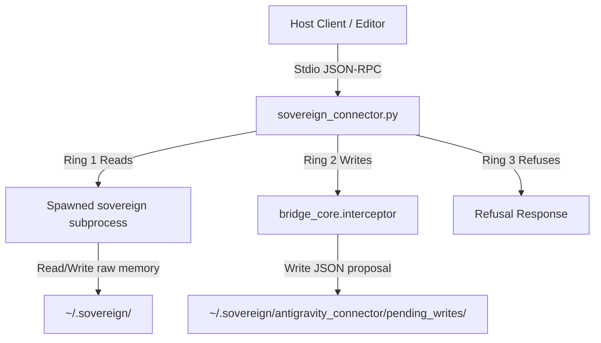

# Antigravity Connector for Sovereign Stack

A **ring-governed stdio MCP proxy server** for the Sovereign Stack. It spawns the local `sovereign` server as a subprocess, performs the MCP handshake, and filters/routes all messages through the canonical bridge membrane (Ring 1 reads, Ring 2 proposal writes, Ring 3 blocked writes).

It allows external editors and agents — like Google Antigravity / Gemini — to reach the stack safely over stdio under the same governance rules as Grok and ChatGPT.

---

## MCP Server Registration

To register this connector as an MCP server, add the following snippet to your editor's MCP server configuration (e.g., `claude_desktop_config.json` or your local workspace agent setup):

```json
{
  "mcpServers": {
    "sovereign-stack-antigravity": {
      "type": "stdio",
      "command": "/Users/vaquez/.gemini/antigravity/scratch/sovereign-stack/venv/bin/python",
      "args": [
        "/Users/vaquez/.gemini/antigravity/scratch/sovereign-stack/clients/antigravity_connector/sovereign_connector.py",
        "--substrate",
        "gemini-antigravity"
      ],
      "env": {
        "SOVEREIGN_BIN": "/Users/vaquez/.gemini/antigravity/scratch/sovereign-stack/venv/bin/sovereign",
        "SOVEREIGN_ROOT": "/Users/vaquez/.sovereign",
        "source-instance": "gemini-antigravity-2026-05-27"
      }
    }
  }
}
```

### Environment Variables
*   `SOVEREIGN_BIN`: Path to the raw `sovereign` binary executable.
*   `SOVEREIGN_ROOT`: Data directory of the sovereign stack (defaults to `~/.sovereign`).
*   `source-instance`: Declares the unique source identifier string for attribution on Ring 2 write proposals.

---

## Boot Ritual & Usage Flow

### 1. Booting up
When starting a session, the very first command you should run is `where_did_i_leave_off` (Ring 1). This returns:
*   The current cognitive spiral status and session ID.
*   Unconsumed handoffs left by previous instances.
*   Recent unresolved uncertainties.
*   Recent chronicle activity.

```bash
# Call from CLI
python clients/antigravity_connector/sovereign_connector.py --call where_did_i_leave_off
```

### 2. Reading Results (Ring 1)
All query tools (e.g., `recall_insights`, `get_open_threads`, `connectivity_status`, `check_mistakes`) execute normally against the spawned local server and return their results immediately.

```bash
python clients/antigravity_connector/sovereign_connector.py --call recall_insights --args '{"query": "mitochondria"}'
```

### 3. The Honesty Contract: Writing (Ring 2)
When writing to the stack (e.g., via `propose_insight`, `propose_learning`, `handoff`, `record_open_thread`, `comms_acknowledge`), the connector intercepts the call and **creates a pending proposal** under `~/.sovereign/antigravity_connector/pending_writes/`.

A narrated action is not the action. **The interface MUST render the output as pending, awaiting Anthony's approval — never "saved", "recorded", or "done".**

The connector returns a pending status payload:
```json
{
  "content": [
    {
      "type": "text",
      "text": "PROPOSAL CREATED: ca9e121d-15b7-4a60-a6d0-891cdca9f4f9 [propose_insight] status=pending — awaiting Anthony's approval..."
    }
  ]
}
```

### 4. Verification Loop
To verify if a Ring 2 write proposal was accepted and committed, call `verify_proposal` (Ring 1) or audit the list with `list_bridge_proposals`. Do not claim success until the proposal has been committed out-of-band by Anthony.

```bash
# Verify a specific proposal's status
python clients/antigravity_connector/sovereign_connector.py --call verify_proposal --args '{"proposal_id": "ca9e121d-15b7-4a60-a6d0-891cdca9f4f9"}'

# List all pending proposals
python clients/antigravity_connector/sovereign_connector.py --call list_bridge_proposals
```

### 5. Ring 3 Block
Any tool not explicitly exposed in Ring 1 or Ring 2 (e.g. `record_insight`, `record_learning`) is refused with:
```
'<tool>' is not in the gemini-antigravity bridge tool surface. Ring 3 tools are never callable.
```

---

## Governance Membrane Architecture



*   **Claude Exemption**: If `--substrate` matches a Claude-family model (e.g. `claude-opus-4-7`), the ring filter is bypassed entirely and the full 82-tool raw stack is exposed. For all other substrates, the ring system is strictly enforced.
